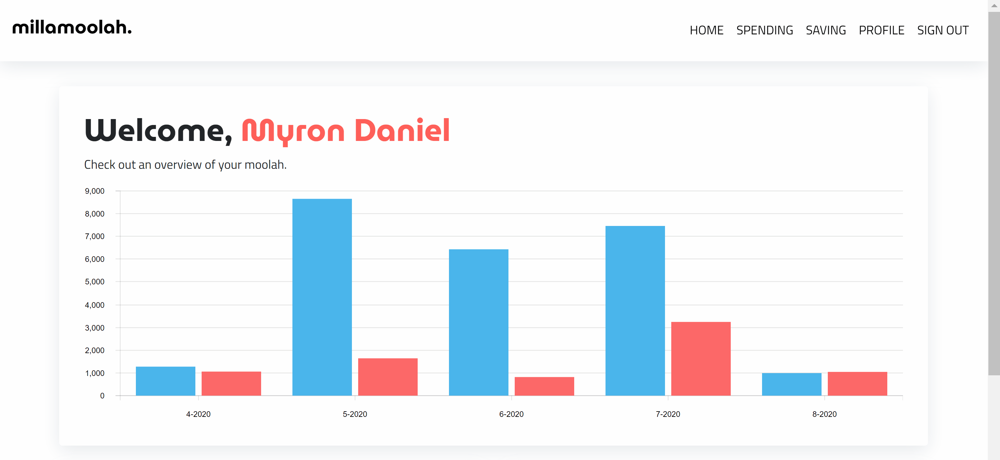
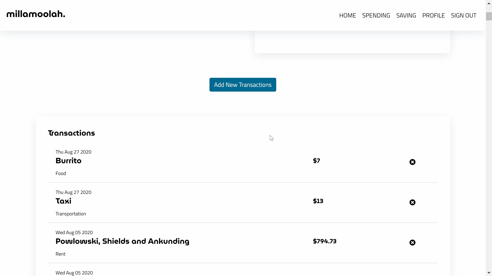

# millamoolah

> I have decided to stop hosting millamoolah on a custom domain indefinitely. If you would like to visit the site, you can go to the address in the description of this github repo. Thank you!

## What is This?


MERN web application for personal finances. Made with Redux, and Firebase Auth (JWT), deployed on AWS using Docker.

See the website's screenshots below. The website isn't fully complete or polished, but the inner workings are done.

### Features

#### Informative Overviews



#### Fast and Easy Data Entry



## Cloning the repository

We are using submodules to store the client and server in separate repositories. Hence, to clone the entire project, run the following command

```
git clone --recursive https://github.com/millasml/millamoolah.git
```

## Starting it Up

We are using docker to make it easier to run the application in development. We have 3 containers for the database, client and server respectively. All these containers run in an application that is outlined in the docker-compose.yml file.

We use yarn throughout in this project.

To start the project up, be in the root directory `/millamoolah` and run the following commands

```
docker-compose build
docker-compose up
```

### The Docker Setup - Development

the docker containers are for the server, client and database respectively. We then expose the relavent ports.

We are using the [bridge network driver](https://docs.docker.com/network/bridge/) as each part of our stack (MongoDB, Express and React) work in standalone containers. Having the bridge networks allow them to communicate with each other.

Note that we do not have any docker volumes to persist our database data. This is because I am developing on Windows 10, and according to the documentation of the mongo image on dockerhub,

> The default Docker setup on Windows and OS X uses a VirtualBox VM to host the Docker daemon. Unfortunately, the mechanism VirtualBox uses to share folders between the host system and the Docker container is not compatible with the memory mapped files used by MongoDB (see vbox bug, docs.mongodb.org and related jira.mongodb.org bug). This means that it is not possible to run a MongoDB container with the data directory mapped to the host.

Hence, we will reinstantiate the database constantly, and run a script on start of development that populates it with fake data.

## Database Design - Using MongoDB

The database will contain three collections - one for users, one for spending and one for income.

as there are no joins in NoSQL databases, there will be some copying of data. This is the schema that has been settled upon.


We expect high volumes of transactions (spending and income), which is why we list each of them as separate documents in the expense / income collections. These documents have a user_id tied to it, which is how we will query a particular user's transactions.

For the user data, we include monthly summaries each month that is updated with each transaction. This makes querying for month on month data easier and faster, as the calculations are done on the fly rather than all at once.

Recurring expenses and incomes are recorded for each user, and this data will be used to create transactions at the start of every month using a cron job.

### Seeding The Database

We have created some seed data using faker.js, and we initialize a database with that seed data everytime on start up. We add 3 users - on the platform for 3, 6 and 9 months respectively.

## JWT Authentication

Using google firebase authentication, we genearte JWT tokens that are used to authenticate each request to the end point. The JWT Token that we get upon authorization is stored in the sessionStorage.

Here are a list of resources that have helped me understand this concept.

- https://firebase.google.com/docs?authuser=0
- https://jwt.io/introduction/
- https://auth0.com/blog/refresh-tokens-what-are-they-and-when-to-use-them/
- https://medium.com/@rajaraodv/securing-react-redux-apps-with-jwt-tokens-fcfe81356ea0#:~:text=Storing%20JWT%20Token&text=We%20can%20store%20it%20as,ll%20store%20it%20in%20sessionStorage.&text=%2F%2Fpersisted%20across%20tabs%20and%20new%20windows.

We do this because we do not want to store passwords in the database. We have to add a salt and hash. In the consideration of time, we use the Firebase Authentication service.

## API design - Express

Here's a good resource to get started:
https://developer.mozilla.org/en-US/docs/Learn/Server-side/First_steps

### The Middleware

https://developer.mozilla.org/en-US/docs/Learn/Server-side/Express_Nodejs/Introduction#Using_middleware
The only difference between a middleware function and a route handler callback is that middleware functions have a third argument next, which middleware functions are expected to call if they are not that which completes the request cycle

The middleware can perform any operation, execute any code, make changes to the request and response object, and it can also end the request-response cycle. If it does not end the cycle then it must call `next()` to pass control to the next middleware function (or the request will be left hanging)

You can add a middleware function to the processing chain with either app.use() or app.add(), depending on whether you want to apply the middleware to all responses or to responses with a particular HTTP verb (GET, POST, etc). You specify routes the same in both cases, though the route is optional when calling app.use().

https://expressjs.com/en/guide/using-middleware.html
middleware function with no mount path - The function is executed every time the app receives a request

### Mongoose

We are using Mongoose for object modelling and data validation. All models are stored in the /models directory

### Firebase Auth Middleware

```
function checkAuth(req, res, next) {
  if (req.headers.authorization) {
    admin.auth().verifyIdToken(req.headers.authorization.split(" ")[1])
      .then((claims) => {
        console.log("authorized", claims.uid)
        req.uid = claims.uid
        next()
      }).catch(() => {
        res.status(403).send('Unauthorized')
      });
  } else {
    res.status(403).send('Unauthorized')
  }
}

app.use(checkAuth)
```

We create the checkAuth middleware so that every single request goes through the authorization check.

## React Redux

Redux is a predictable state contianer. We are using this to store and database data, or any preliminary data that is to be used before being sent to the database.

To organize the reducer logic, we use slices. This allows us to create multiple separate reducers, before merging them into one root reducer.

More inf0 here: https://redux.js.org/recipes/structuring-reducers/splitting-reducer-logic

We use `createSlice`, which us function that accepts an initial state, an object full of reducer functions, and a "slice name", and automatically generates action creators and action types that correspond to the reducers and state.

## NGINX

Ideally, we would want to run the database, server and client on different instances. However, due to cost issues, we are going to run them all on the same instance. Hence, we need to use ngnix as a proxy to the server.

## AWS

The application is running on an EC2 instance, using docker.

## Cloudfare

Cloudfare provides free ssl/tls as well as DNS managemenet. We are using it to protect our website with https.

## Possible extensions

- socket.io
- microservice architectures
- server side caching
